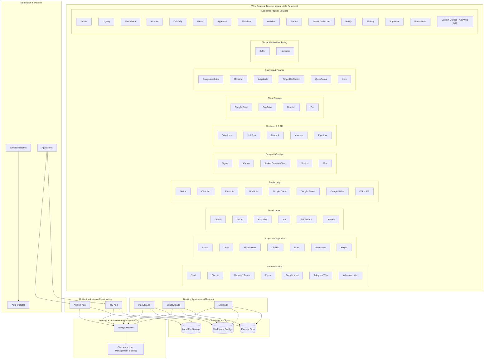
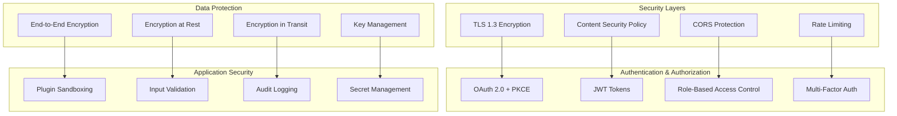
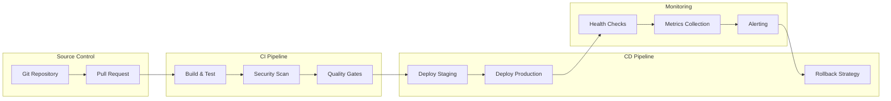

# Production Readiness Design Document

## Overview

This design document outlines the comprehensive architecture and implementation strategy for transforming Flow Desk from a development-ready application to a production-grade enterprise solution. Flow Desk is primarily a **workspace management desktop (Electron) and mobile (React Native) application** that provides secure, isolated browser views for web applications like Slack, Notion, GitHub, Zoom, and Teams - **without any API integrations, just pure web browser functionality**. Each service in a workspace is simply a web browser view that loads the service's web interface. The Next.js server component serves as a **marketing website and license management system** using Clerk for user management and billing. The design addresses security hardening, deployment automation, monitoring infrastructure, performance optimization, and enterprise-grade features while maintaining the existing workspace-centric, privacy-first architecture.

## Architecture

### High-Level Production Architecture



### Security Architecture



## Components and Interfaces

### 1. Browser View Security Manager

**Location:** `desktop-app/src/main/security/`

```typescript
interface BrowserViewSecurityManager {
  // Browser view isolation
  createSecureBrowserView(serviceConfig: ServiceConfig): Promise<BrowserView>;
  configureBrowserViewSecurity(view: BrowserView, workspace: Workspace): void;
  
  // Session management
  createIsolatedSession(workspaceId: string, serviceId: string): Session;
  clearBrowserViewData(viewId: string): Promise<void>;
  
  // Content security
  enforceContentSecurityPolicy(view: BrowserView): void;
  blockMaliciousContent(view: BrowserView): void;
  
  // Input validation for workspace/service creation
  validateWorkspaceInput(input: unknown): ValidationResult;
  validateServiceUrl(url: string): ValidationResult;
  sanitizeServiceName(name: string): string;
  
  // Security policies for browser views
  enforceWebSecurity(view: BrowserView): void;
  preventNodeIntegration(view: BrowserView): void;
  
  // Audit logging for workspace actions
  logWorkspaceEvent(event: WorkspaceSecurityEvent): void;
  getWorkspaceAuditTrail(workspaceId: string): Promise<AuditEntry[]>;
}

interface ServiceConfig {
  name: string;
  url: string;
  type: string; // Can be any of the 60+ predefined types or 'custom-template' for any web app
  isolation: 'shared' | 'isolated';
  customIcon?: string; // For custom services
  customColor?: string; // For custom services
}

interface WorkspaceSecurityEvent {
  type: 'workspace_created' | 'service_added' | 'service_loaded' | 'security_violation';
  severity: 'low' | 'medium' | 'high' | 'critical';
  workspaceId: string;
  serviceId?: string;
  action: string;
  timestamp: Date;
  metadata: Record<string, unknown>;
}
```

### 2. Production Build System

**Location:** `scripts/build/`

```typescript
interface BuildManager {
  // Cross-platform builds
  buildDesktop(platform: Platform, arch: Architecture): Promise<BuildResult>;
  buildMobile(platform: 'ios' | 'android'): Promise<BuildResult>;
  buildServer(): Promise<BuildResult>;
  
  // Code signing
  signExecutable(path: string, certificate: Certificate): Promise<void>;
  notarizeApp(appPath: string, credentials: NotarizeCredentials): Promise<void>;
  
  // Distribution
  createInstaller(buildPath: string, config: InstallerConfig): Promise<string>;
  uploadToStore(packagePath: string, store: AppStore): Promise<void>;
  
  // Optimization
  optimizeAssets(buildPath: string): Promise<void>;
  generateSourceMaps(buildPath: string): Promise<void>;
}

interface BuildResult {
  success: boolean;
  outputPath: string;
  size: number;
  duration: number;
  warnings: string[];
  errors: string[];
}

interface Certificate {
  path: string;
  password: string;
  type: 'codesign' | 'authenticode';
}
```

### 3. Monitoring and Observability

**Location:** `shared/src/monitoring/`

```typescript
interface MonitoringManager {
  // Health checks
  getHealthStatus(): Promise<HealthStatus>;
  registerHealthCheck(name: string, check: HealthCheck): void;
  
  // Metrics collection
  recordMetric(name: string, value: number, tags?: Tags): void;
  incrementCounter(name: string, tags?: Tags): void;
  recordTiming(name: string, duration: number, tags?: Tags): void;
  
  // Error tracking
  captureError(error: Error, context?: ErrorContext): void;
  captureException(exception: Exception, context?: ErrorContext): void;
  
  // Performance monitoring
  startTransaction(name: string): Transaction;
  recordPerformance(metrics: PerformanceMetrics): void;
  
  // Logging
  log(level: LogLevel, message: string, metadata?: LogMetadata): void;
  createLogger(component: string): Logger;
}

interface HealthStatus {
  status: 'healthy' | 'degraded' | 'unhealthy';
  checks: Record<string, HealthCheckResult>;
  timestamp: Date;
  uptime: number;
}

interface PerformanceMetrics {
  memoryUsage: MemoryInfo;
  cpuUsage: number;
  responseTime: number;
  throughput: number;
  errorRate: number;
}
```

### 4. Workspace Data Management

**Location:** `desktop-app/src/main/data/`

```typescript
interface WorkspaceDataManager {
  // Workspace configuration backup
  createWorkspaceBackup(workspaceId: string, options: BackupOptions): Promise<BackupResult>;
  restoreWorkspaceBackup(backupId: string, options: RestoreOptions): Promise<void>;
  listWorkspaceBackups(workspaceId?: string): Promise<BackupInfo[]>;
  
  // Configuration export/import
  exportWorkspaceConfig(workspaceId: string): Promise<WorkspaceConfig>;
  importWorkspaceConfig(config: WorkspaceConfig): Promise<ImportResult>;
  
  // Data migration for app updates
  migrateWorkspaceData(fromVersion: string, toVersion: string): Promise<MigrationResult>;
  validateWorkspaceIntegrity(workspaceId: string): Promise<IntegrityReport>;
  
  // Electron Store management
  cleanupWorkspaceData(workspaceId: string): Promise<CleanupResult>;
  optimizeElectronStore(): Promise<StorageOptimization>;
  
  // Browser session management (cookies, localStorage, etc.)
  clearBrowserSessionData(workspaceId: string, serviceId?: string): Promise<void>;
  backupBrowserSessions(workspaceId: string): Promise<SessionBackup>;
}

interface BackupOptions {
  includeServiceConfigs: boolean;
  includeBrowserSessions: boolean; // cookies, localStorage, sessionStorage
  compression: 'none' | 'gzip';
  encryption: boolean;
}

interface WorkspaceConfig {
  workspace: Workspace;
  services: WorkspaceService[]; // Just URL, name, type - no API data
  settings: WorkspaceSettings;
  browserSessions?: BrowserSessionData[]; // Browser state, not API data
}
```

### 5. Electron Performance Manager

**Location:** `desktop-app/src/main/performance/`

```typescript
interface ElectronPerformanceManager {
  // Browser view management
  optimizeBrowserViews(): Promise<BrowserViewOptimization>;
  manageBrowserViewLimit(maxViews: number): Promise<void>;
  cleanupInactiveBrowserViews(): Promise<CleanupResult>;
  
  // Memory management
  monitorMemoryUsage(): Promise<MemoryStats>;
  triggerGarbageCollection(): Promise<void>;
  optimizeElectronStore(): Promise<StorageOptimization>;
  
  // Startup optimization
  preloadCriticalResources(): Promise<void>;
  optimizeAppStartup(): Promise<StartupOptimization>;
  
  // Performance monitoring
  measureBrowserViewPerformance(viewId: string): Promise<BrowserViewMetrics>;
  profileWorkspaceMemory(workspaceId: string): Promise<WorkspaceMemoryProfile>;
  monitorCPUUsage(): Promise<CPUProfile>;
}

interface BrowserViewOptimization {
  viewsOptimized: number;
  memoryFreed: number;
  performanceGain: number;
}

interface BrowserViewMetrics {
  loadTime: number;
  memoryUsage: number;
  cpuUsage: number;
  networkRequests: number;
}
```

### 6. Enterprise Integration Layer

**Location:** `shared/src/enterprise/`

```typescript
interface EnterpriseManager {
  // Identity management
  configureSSOProvider(config: SSOConfig): Promise<void>;
  authenticateUser(credentials: Credentials): Promise<AuthResult>;
  authorizeAction(user: User, resource: string, action: string): Promise<boolean>;
  
  // Policy management
  enforcePolicy(policy: Policy, context: PolicyContext): Promise<PolicyResult>;
  updatePolicies(policies: Policy[]): Promise<void>;
  auditCompliance(): Promise<ComplianceReport>;
  
  // User management
  provisionUser(userInfo: UserInfo): Promise<User>;
  deprovisionUser(userId: string): Promise<void>;
  syncUserDirectory(): Promise<SyncResult>;
  
  // Reporting and analytics
  generateUsageReport(period: TimePeriod): Promise<UsageReport>;
  exportAuditLogs(filters: AuditFilters): Promise<AuditExport>;
  getComplianceStatus(): Promise<ComplianceStatus>;
}

interface SSOConfig {
  provider: 'saml' | 'oidc' | 'ldap';
  endpoint: string;
  certificate?: string;
  clientId?: string;
  clientSecret?: string;
}

interface Policy {
  id: string;
  name: string;
  type: 'security' | 'access' | 'data' | 'usage';
  rules: PolicyRule[];
  enforcement: 'strict' | 'warn' | 'audit';
}
```

## Data Models

### Workspace Security Models

```typescript
// Browser view security configuration
interface BrowserViewSecurityConfig {
  id: string;
  workspaceId: string;
  serviceId: string;
  isolation: 'shared' | 'isolated';
  webSecurity: boolean;
  nodeIntegration: boolean;
  contextIsolation: boolean;
  sandbox: boolean;
  allowedOrigins: string[];
  blockedUrls: string[];
}

// Workspace audit trail
interface WorkspaceAuditEntry {
  id: string;
  timestamp: Date;
  workspaceId: string;
  serviceId?: string;
  event: WorkspaceSecurityEvent;
  action: string;
  result: 'success' | 'failure' | 'blocked';
  userAgent: string;
  metadata: Record<string, unknown>;
}

// Simple workspace permissions (no complex RBAC needed for single-user app)
interface WorkspacePermission {
  workspaceId: string;
  canModify: boolean;
  canDelete: boolean;
  canAddServices: boolean;
  canRemoveServices: boolean;
}

// Browser session isolation
interface BrowserSessionConfig {
  workspaceId: string;
  serviceId: string;
  sessionPartition: string;
  persistSession: boolean;
  clearOnExit: boolean;
}
```

### Production Configuration Models

```typescript
// Environment configuration for local-first apps
interface ProductionConfig {
  environment: 'development' | 'staging' | 'production';
  security: SecurityConfig;
  monitoring: MonitoringConfig;
  performance: PerformanceConfig;
  backup: BackupConfig;
  licensing: LicensingConfig;
}

interface SecurityConfig {
  encryption: {
    algorithm: string;
    keyRotationInterval: number;
    requireMFA: boolean;
  };
  localData: {
    encryptionAtRest: boolean;
    secureKeyStorage: boolean;
    dataValidation: boolean;
  };
  audit: {
    enabled: boolean;
    retentionDays: number;
    localLogging: boolean;
  };
}

interface LicensingConfig {
  website: {
    url: string;
    clerkPublishableKey: string;
  };
  validation: {
    offlineGracePeriod: number;
    licenseCheckInterval: number;
    fallbackMode: boolean;
  };
}

interface MonitoringConfig {
  errorTracking: {
    enabled: boolean;
    sampleRate: number;
    environment: string;
    localOnly: boolean; // For privacy-first approach
  };
  metrics: {
    enabled: boolean;
    interval: number;
    localRetention: number;
  };
  logging: {
    level: LogLevel;
    structured: boolean;
    localDestinations: LogDestination[];
  };
}
```

### Backup and Recovery Models

```typescript
// Backup metadata
interface BackupMetadata {
  id: string;
  timestamp: Date;
  version: string;
  type: 'full' | 'incremental' | 'differential';
  size: number;
  checksum: string;
  encryption: boolean;
  compression: string;
  retentionPolicy: string;
}

// Data synchronization
interface SyncState {
  lastSync: Date;
  conflicts: DataConflict[];
  pendingChanges: Change[];
  syncStrategy: SyncStrategy;
}

interface DataConflict {
  id: string;
  resource: string;
  localVersion: unknown;
  remoteVersion: unknown;
  timestamp: Date;
  resolution?: ConflictResolution;
}
```

## Error Handling

### Production Error Management

```typescript
// Centralized error handling
class ProductionErrorHandler {
  private errorTracking: ErrorTrackingService;
  private alerting: AlertingService;
  private recovery: RecoveryService;
  
  async handleError(error: Error, context: ErrorContext): Promise<void> {
    // Classify error severity
    const severity = this.classifyError(error);
    
    // Log structured error information
    await this.logError(error, context, severity);
    
    // Track error for monitoring
    await this.errorTracking.captureError(error, context);
    
    // Send alerts for critical errors
    if (severity === 'critical') {
      await this.alerting.sendAlert(error, context);
    }
    
    // Attempt automatic recovery
    await this.recovery.attemptRecovery(error, context);
  }
  
  private classifyError(error: Error): ErrorSeverity {
    // Implementation for error classification
  }
}

// Error recovery strategies
interface RecoveryStrategy {
  canRecover(error: Error): boolean;
  recover(error: Error, context: ErrorContext): Promise<RecoveryResult>;
  rollback?(context: ErrorContext): Promise<void>;
}

// Circuit breaker pattern for external services
class CircuitBreaker {
  private state: 'closed' | 'open' | 'half-open' = 'closed';
  private failureCount = 0;
  private lastFailureTime?: Date;
  
  async execute<T>(operation: () => Promise<T>): Promise<T> {
    if (this.state === 'open') {
      if (this.shouldAttemptReset()) {
        this.state = 'half-open';
      } else {
        throw new Error('Circuit breaker is open');
      }
    }
    
    try {
      const result = await operation();
      this.onSuccess();
      return result;
    } catch (error) {
      this.onFailure();
      throw error;
    }
  }
}
```

### Graceful Degradation

```typescript
// Service degradation manager
class DegradationManager {
  private services: Map<string, ServiceHealth> = new Map();
  
  async checkServiceHealth(serviceName: string): Promise<ServiceHealth> {
    // Implementation for health checking
  }
  
  async degradeService(serviceName: string, level: DegradationLevel): Promise<void> {
    // Implementation for service degradation
  }
  
  async enableFallback(serviceName: string, fallback: FallbackStrategy): Promise<void> {
    // Implementation for fallback activation
  }
}

interface ServiceHealth {
  status: 'healthy' | 'degraded' | 'failed';
  responseTime: number;
  errorRate: number;
  lastCheck: Date;
}

type DegradationLevel = 'none' | 'partial' | 'minimal' | 'offline';
```

## Testing Strategy

### Comprehensive Testing Framework

```typescript
// Production testing suite
interface TestSuite {
  // Unit testing
  runUnitTests(): Promise<TestResults>;
  
  // Integration testing
  runIntegrationTests(): Promise<TestResults>;
  
  // End-to-end testing
  runE2ETests(environment: string): Promise<TestResults>;
  
  // Security testing
  runSecurityTests(): Promise<SecurityTestResults>;
  
  // Performance testing
  runPerformanceTests(): Promise<PerformanceTestResults>;
  
  // Load testing
  runLoadTests(config: LoadTestConfig): Promise<LoadTestResults>;
}

// Automated testing pipeline
class TestPipeline {
  async runFullSuite(): Promise<PipelineResult> {
    const results = await Promise.all([
      this.runUnitTests(),
      this.runIntegrationTests(),
      this.runSecurityScans(),
      this.runPerformanceBenchmarks()
    ]);
    
    return this.aggregateResults(results);
  }
}

// Test data management
interface TestDataManager {
  generateTestData(schema: DataSchema): Promise<TestData>;
  cleanupTestData(): Promise<void>;
  seedDatabase(data: SeedData): Promise<void>;
}
```

### Quality Gates

```typescript
// Quality gate definitions
interface QualityGate {
  name: string;
  criteria: QualityCriteria[];
  blocking: boolean;
}

interface QualityCriteria {
  metric: string;
  threshold: number;
  operator: 'gt' | 'lt' | 'eq' | 'gte' | 'lte';
}

// Example quality gates
const PRODUCTION_QUALITY_GATES: QualityGate[] = [
  {
    name: 'Code Coverage',
    criteria: [{ metric: 'coverage', threshold: 90, operator: 'gte' }],
    blocking: true
  },
  {
    name: 'Security Vulnerabilities',
    criteria: [{ metric: 'high_severity_vulns', threshold: 0, operator: 'eq' }],
    blocking: true
  },
  {
    name: 'Performance Benchmarks',
    criteria: [{ metric: 'startup_time', threshold: 3000, operator: 'lt' }],
    blocking: true
  }
];
```

## Deployment Architecture

### CI/CD Pipeline Design



### Deployment Configuration

```typescript
// Simple deployment configuration for Flow Desk
interface DeploymentConfig {
  // Website deployment (Vercel)
  website: {
    platform: 'vercel';
    domain: string;
    clerkConfig: ClerkConfig;
  };
  
  // Desktop app distribution
  desktop: {
    platforms: ('mac' | 'windows' | 'linux')[];
    codeSigningCerts: CodeSigningConfig;
    autoUpdater: AutoUpdaterConfig;
  };
  
  // Mobile app distribution
  mobile: {
    platforms: ('ios' | 'android')[];
    appStoreConfig: AppStoreConfig;
  };
}

// Auto-updater configuration
interface AutoUpdaterConfig {
  enabled: boolean;
  updateServer: string; // GitHub releases
  checkInterval: number;
  allowPrerelease: boolean;
}
```

This comprehensive design provides the foundation for transforming Flow Desk into a production-ready enterprise application while maintaining its core workspace-centric architecture and privacy-first principles.