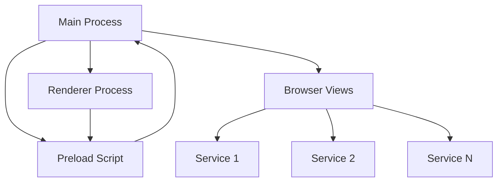

# Flow Desk Architecture

This document provides a comprehensive overview of Flow Desk's system architecture, design decisions, and component interactions.

## Table of Contents

- [Overview](#overview)
- [Multi-Process Architecture](#multi-process-architecture)
- [Core Components](#core-components)
- [Data Flow](#data-flow)
- [Security Model](#security-model)
- [Performance Strategy](#performance-strategy)
- [Browser View System](#browser-view-system)
- [State Management](#state-management)
- [Design Patterns](#design-patterns)

## Overview

Flow Desk follows Electron's multi-process architecture with additional security and performance optimizations. The application is designed around the concept of workspaces containing services, with each service running in an isolated browser environment.



## Multi-Process Architecture

### Main Process (`src/main/`)

The main process serves as the application's backbone, managing:

- **Window Management**: Creates and manages the main application window
- **Workspace Operations**: Handles workspace CRUD operations and persistence
- **Browser View Orchestration**: Creates and manages isolated browser views for services
- **System Integration**: Handles notifications, menu bar, and OS-level features
- **Security Enforcement**: Implements security policies and input validation
- **IPC Coordination**: Manages communication between all processes

**Key Files:**
- `main.ts` - Application entry point and initialization
- `workspace.ts` - Core workspace management logic
- `security-config.ts` - Security policy enforcement
- `notification-manager.ts` - System notification handling

### Renderer Process (`src/renderer/`)

The renderer process hosts the React-based user interface:

- **UI Components**: React components for workspace and service management
- **State Management**: Redux store for application state
- **User Interactions**: Handles all user input and feedback
- **Layout Management**: Responsive design with accessibility features
- **Theme System**: Dynamic theming with system integration

**Key Files:**
- `App.tsx` - Root React component
- `store/` - Redux store configuration and slices
- `components/` - Reusable UI components
- `hooks/` - Custom React hooks for functionality

### Preload Scripts (`src/preload/`)

Preload scripts provide secure communication bridges:

- **API Surface**: Exposes controlled main process functionality
- **Input Validation**: Validates all data before IPC transmission
- **Security Boundaries**: Enforces strict API contracts
- **Type Safety**: Provides TypeScript definitions for API calls

**Key Files:**
- `preload.ts` - Main API surface definition

## Core Components

### WorkspaceManager

The `WorkspaceManager` class is the central orchestrator for workspace operations:

```typescript
/**
 * Core responsibilities:
 * - Workspace lifecycle (create, read, update, delete)
 * - Service management within workspaces
 * - Browser view creation and positioning
 * - Data persistence to local storage
 * - Event emission for UI synchronization
 */
class WorkspaceManager extends EventEmitter {
  // Implementation details in workspace.ts
}
```

**Key Methods:**
- `createWorkspace()` - Creates new workspace with validation
- `loadService()` - Loads service in isolated browser view
- `switchWorkspace()` - Changes active workspace context
- `setMainWindow()` - Configures browser view positioning

### Browser View System

Each service runs in its own `BrowserView` instance:

```typescript
// Browser views provide:
// 1. Process isolation for security
// 2. Independent session storage
// 3. Custom security policies per service
// 4. Proper positioning within main window

const browserView = new BrowserView({
  webPreferences: {
    nodeIntegration: false,
    contextIsolation: true,
    sandbox: true,
    webSecurity: true,
    session: isolatedSession
  }
});
```

### State Management

Redux Toolkit manages application state with the following structure:

```typescript
interface AppState {
  workspace: {
    workspaces: Record<string, Workspace>;
    currentWorkspaceId: string | null;
    isLoading: boolean;
    error: string | null;
  };
  theme: {
    mode: 'light' | 'dark' | 'system';
    accentColor: string;
  };
}
```

## Data Flow

### Workspace Creation Flow

1. **User Action**: User clicks "Create Workspace" in UI
2. **Validation**: Form data validated in renderer process
3. **IPC Call**: Validated data sent to main process via preload API
4. **Business Logic**: Main process creates workspace using WorkspaceManager
5. **Persistence**: Workspace data saved to local JSON file
6. **Event Emission**: WorkspaceManager emits 'workspace-created' event
7. **State Update**: Renderer process refreshes workspace list
8. **UI Update**: React components re-render with new workspace

### Service Loading Flow

1. **User Selection**: User clicks on service in sidebar
2. **IPC Request**: Service load request sent to main process
3. **Browser View Creation**: WorkspaceManager creates/retrieves browser view
4. **Security Configuration**: Browser view configured with proper isolation
5. **URL Loading**: Service URL loaded in browser view
6. **Positioning**: Browser view positioned correctly in main window
7. **Visibility Management**: Browser view shown/hidden based on UI state

## Security Model

### Process Isolation

- **Main Process**: Runs with full system access but no direct user input
- **Renderer Process**: Sandboxed with no Node.js access
- **Browser Views**: Fully sandboxed with custom security policies
- **Preload Scripts**: Controlled API surface with input validation

### Data Isolation

```typescript
// Workspace isolation strategies:
type BrowserIsolation = 'shared' | 'isolated';

// 'isolated': Each service gets its own session partition
// 'shared': Services share session within workspace

const sessionName = workspace.browserIsolation === 'isolated' 
  ? `workspace-${workspace.id}-service-${service.id}`
  : `workspace-shared`;
```

### Input Validation

All IPC communications include comprehensive input validation:

```typescript
const validateUrl = (url: unknown): string => {
  const validatedUrl = validateString(url, 2000);
  const parsedUrl = new URL(validatedUrl);
  if (!['http:', 'https:'].includes(parsedUrl.protocol)) {
    throw new Error('Invalid URL protocol');
  }
  return validatedUrl;
};
```

## Performance Strategy

### Memory Management

- **Browser View Reuse**: Views are cached and reused when possible
- **Cleanup on Deletion**: Proper cleanup when workspaces/services are deleted
- **Performance Monitoring**: Development-time performance tracking

### Lazy Loading

- **Component Loading**: Heavy React components loaded on demand
- **Asset Optimization**: Images and icons loaded asynchronously
- **Service Initialization**: Browser views created only when needed

### State Optimization

- **Memoized Selectors**: Redux selectors use memoization for performance
- **Component Memoization**: React.memo used for expensive components
- **Debounced Operations**: User inputs debounced to prevent excessive updates

## Browser View System

### Positioning Algorithm

Browser views are positioned to account for the application's layout:

```typescript
const positionBrowserView = (browserView: BrowserView) => {
  const contentBounds = mainWindow.getContentBounds();
  const leftRailWidth = LAYOUT_CONSTANTS.PRIMARY_SIDEBAR_WIDTH; // 64px
  const servicesSidebarWidth = LAYOUT_CONSTANTS.SERVICES_SIDEBAR_WIDTH; // 256px
  const headerHeight = LAYOUT_CONSTANTS.TOP_BAR_HEIGHT; // 0px (no header)
  
  browserView.setBounds({
    x: leftRailWidth + servicesSidebarWidth,
    y: headerHeight,
    width: contentBounds.width - (leftRailWidth + servicesSidebarWidth),
    height: contentBounds.height - headerHeight
  });
};
```

### Session Management

Each service can have different session configurations:

- **Isolated Mode**: Unique session per service
- **Shared Mode**: Shared session within workspace
- **Custom Headers**: Service-specific HTTP headers
- **User Agent Overrides**: Custom user agent strings

## State Management

### Redux Architecture

```typescript
// Async thunks handle complex operations
export const loadWorkspaces = createAsyncThunk(
  'workspace/loadWorkspaces',
  async () => {
    const workspaces = await window.flowDesk.workspace.list();
    return { workspaces };
  }
);

// Reducers handle synchronous state updates
const workspaceSlice = createSlice({
  name: 'workspace',
  initialState,
  reducers: {
    setLoading: (state, action) => {
      state.isLoading = action.payload;
    }
  },
  extraReducers: (builder) => {
    builder.addCase(loadWorkspaces.fulfilled, (state, action) => {
      state.workspaces = action.payload.workspaces;
    });
  }
});
```

### Data Synchronization

- **Main Process**: Single source of truth for workspace data
- **Renderer Process**: Cached copy of workspace state in Redux
- **Synchronization**: Triggered by user actions and IPC events
- **Optimistic Updates**: UI updates immediately with rollback on errors

## Design Patterns

### Event-Driven Architecture

The `WorkspaceManager` uses the EventEmitter pattern:

```typescript
// Events emitted by WorkspaceManager:
workspaceManager.on('workspace-created', (workspace) => {
  // Handle workspace creation
});

workspaceManager.on('service-loaded', (workspaceId, serviceId) => {
  // Handle service loading
});
```

### Command Pattern

IPC handlers follow a command pattern structure:

```typescript
ipcMain.handle('workspace:create', async (event, workspaceData) => {
  // Validate input
  // Execute business logic
  // Return result or throw error
});
```

### Observer Pattern

React components observe Redux state changes:

```typescript
const workspaces = useAppSelector(selectAllWorkspaces);
const dispatch = useAppDispatch();

// Components automatically re-render when state changes
```

### Factory Pattern

Browser view creation uses factory pattern:

```typescript
private async createBrowserViewForService(
  service: WorkspaceService, 
  workspace: Workspace
): Promise<BrowserView> {
  // Create session based on isolation strategy
  // Configure security preferences
  // Return configured browser view
}
```

## Extensibility Points

### Plugin System

The architecture supports future plugin integration:

- **Plugin Runtime**: Sandboxed execution environment for plugins
- **API Surface**: Controlled access to workspace and service APIs
- **Event System**: Plugins can listen to workspace events

### Custom Service Types

New service types can be added through:

- **Service Type Registry**: Mapping service types to configurations
- **Icon System**: Custom icons for new service types
- **Configuration Schemas**: Validation schemas for service-specific settings

## Error Handling Strategy

### Graceful Degradation

- **Network Errors**: Services continue to work offline where possible
- **Permission Errors**: Clear user feedback with recovery suggestions
- **System Errors**: Fallback behaviors to maintain functionality

### Error Boundaries

React error boundaries prevent UI crashes:

```typescript
<WorkspaceErrorBoundary>
  <ServiceComponent />
</WorkspaceErrorBoundary>
```

### Logging Strategy

Comprehensive logging at multiple levels:

- **Debug**: Development-time debugging information
- **Info**: General application flow and user actions
- **Warn**: Recoverable issues that need attention
- **Error**: Critical errors that affect functionality

---

This architecture supports Flow Desk's core goals of security, performance, and user experience while maintaining extensibility for future enhancements.